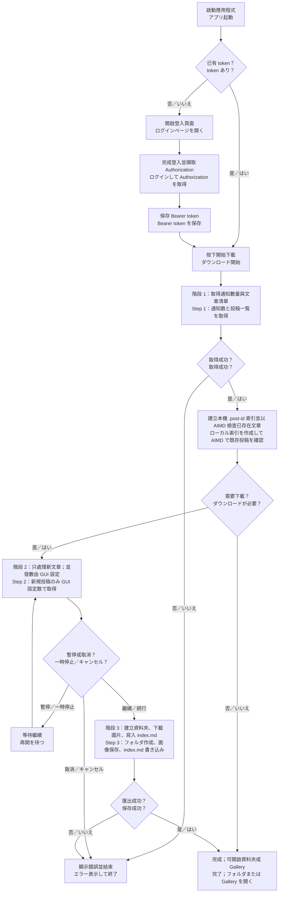

# Takaneko Fanclub Downloader

Takaneko Fanclub 內容下載器（Electron 桌面應用程式）

Takaneko Fanclub の投稿を取得して、Markdown と画像として保存する Electron デスクトップアプリです。

> 僅供已取得 Takaneko Fanclub 合法存取權限的使用者使用。請遵守網站條款、著作權與內容使用規範。
>
> Takaneko Fanclub への正規のアクセス権を持つユーザーのみ利用してください。サイト規約、著作権およびコンテンツ利用規約を遵守してください。

## 功能／機能

- 透過內建登入視窗登入 Takaneko Fanclub，並自動擷取 API 使用的 Bearer token。
  - 内蔵ログインウィンドウで Takaneko Fanclub にログインし、API 通信用の Bearer token を自動取得します。
- 依序執行三個下載階段：取得文章清單、取得文章詳細內容、儲存 Markdown 與圖片。
  - 3 段階（投稿一覧取得、投稿詳細取得、Markdown／画像保存）でダウンロードします。
- 詳細內容與檔案輸出採批次處理，預設最多同時處理 5 筆。
  - 詳細取得とファイル保存はバッチ処理で行い、既定では最大 5 件を並列処理します。
- 先掃描本機 `.post-id` 索引並跳過已匯出的文章；索引掃描使用 AIMD 動態調整併發，避免文章數量大時固定 5 筆檢查過慢。
  - 先にローカルの `.post-id` 索引を走査して既存投稿をスキップします。索引走査は AIMD で並列数を動的に調整し、大量投稿でも固定 5 件ずつの確認を避けます。
- 下載中可暫停、繼續或取消，並顯示各階段進度。
  - ダウンロード中は一時停止、再開、キャンセルが可能で、各段階の進捗を表示します。
- GUI 可設定真正需要抓取／儲存的文章並發數，範圍為 1–32，預設為 5。
  - GUI から実際に取得・保存する投稿の並列数を 1–32 の範囲で設定できます。既定値は 5 です。
- Gallery 可按成員瀏覽所有圖片，或開啟文章列表閱讀匯出的 Markdown。
  - Gallery ではメンバー別に画像一覧を表示し、投稿一覧から保存済み Markdown を閲覧できます。

## 執行環境／動作環境

- Node.js 與 npm
  - Node.js と npm
- 可連線至以下網站：
  - `https://takanekofc.com`
  - `https://api.takanekofc.com`
- 建議使用支援 Electron 28 的 64 位元桌面環境。
  - Electron 28 に対応した 64 ビットのデスクトップ環境を推奨します。

## 安裝與啟動／インストールと起動

在專案根目錄執行：

プロジェクトのルートディレクトリで実行してください：

```bash
npm install
npm start
```

## 使用方式／使い方

1. 按下 Login／ログイン，開啟 Takaneko Fanclub 登入頁面。
2. 在登入視窗完成登入後，按下 Token Capture／トークン取得。
3. 確認狀態顯示已登入，再按下 Start Download／ダウンロード開始。
4. 在下載卡片設定「下載並發數／ダウンロード並列数」（預設 5）。已匯出的文章會先被跳過，只有新文章使用此數值處理。
   - ダウンロードカードで「ダウンロード並列数」を設定します（既定値 5）。既存投稿は先にスキップされ、新規投稿だけがこの値で処理されます。
5. 等待三個階段完成；若需要，可按 Pause／一時停止、Resume／再開或 Cancel／停止。
6. 按 Open Folder／フォルダを開く查看匯出資料，或切換到 Gallery／ギャラリー瀏覽內容。

### 登入與 token／ログインと token

應用程式會在登入視窗的 API request header 中尋找 `Authorization`，成功擷取後以 `Bearer ...` 格式保存。token 由 `electron-store` 儲存於 Electron 的使用者資料目錄，不會寫入專案資料夾。

ログインウィンドウから送信される API リクエストの `Authorization` ヘッダーを検出し、成功すると `Bearer ...` 形式で保存します。token は `electron-store` により Electron のユーザーデータディレクトリへ保存され、プロジェクトフォルダには保存されません。

## 下載流程圖／ダウンロードフローチャート



## 匯出結構／出力構成

匯出根目錄是 Electron 的 `userData/exported`。實際位置依作業系統而不同，可使用應用程式內的 Open Folder／フォルダを開く開啟。

出力先は Electron の `userData/exported` です。実際のパスは OS により異なるため、アプリ内の Open Folder／フォルダを開くから開いてください。

```text
<userData>/exported/
├─ <member-name>/
│  ├─ pictures/
│  │  ├─ <release-date>_01.jpg
│  │  └─ ...
│  └─ <release-date>_<title>/
│     ├─ index.md
│     ├─ .post-id
│     ├─ <release-date>_01.jpg
│     └─ ...
└─ ...
```

`index.md` 會包含文章標題、發送者、日期、內文與本機圖片連結。文章資料夾名稱中的日期格式為 `YYYY-MM-DD_HHMMSS`，圖片會同時保存於文章資料夾與成員的 `pictures/` 資料夾，方便 Gallery 使用。

`index.md` にはタイトル、送信者、日付、本文、ローカル画像へのリンクが含まれます。投稿フォルダ名の日付形式は `YYYY-MM-DD_HHMMSS` です。画像は投稿フォルダとメンバーの `pictures/` の両方に保存され、Gallery から参照できます。

`.post-id` 是由程式自動產生的隱藏索引檔，用來在下次執行時快速判斷文章是否已匯出，請勿手動修改或刪除。

`.post-id` は次回実行時に投稿の保存済み状態を高速判定するために自動生成される隠し索引ファイルです。手動で変更・削除しないでください。

## GitHub Actions 發布／GitHub Actions によるリリース

推送版本 tag（建議格式 `v1.0.0`）後，`.github/workflows/build.yml` 會自動執行：

タグ（推奨形式 `v1.0.0`）を push すると、`.github/workflows/build.yml` が自動的に次を実行します：

1. 在 macOS runner 建置 DMG 與 ZIP。
   - macOS runner で DMG と ZIP をビルドします。
2. 在 Windows runner 建置 x64 NSIS 安裝程式與 portable EXE。
   - Windows runner で x64 NSIS インストーラーと portable EXE をビルドします。
3. 建置完成後，自動建立或更新 GitHub Release，並附加全部產物。
   - 完了後、GitHub Release を自動作成または更新し、全成果物を添付します。

```bash
git add .
git commit -m "Prepare release"
git tag v1.0.0
git push origin main --tags
```

GitHub Actions 需要 repository 的 `contents: write` 權限；workflow 使用 GitHub 內建的 `GITHUB_TOKEN`，不需要額外建立 PAT。

GitHub Actions にはリポジトリの `contents: write` 権限が必要です。workflow は GitHub 標準の `GITHUB_TOKEN` を使用するため、追加の PAT は不要です。

## 打包／パッケージング

```bash
# macOS
npm run build:mac

# Windows x64
npm run build:win

# 依照 electron-builder 的預設平台設定建置
# electron-builder の既定プラットフォーム設定でビルド
npm run build
```

建置輸出到 `dist/`（已列入 `.gitignore`）。macOS 會產生 DMG／ZIP；Windows x64 會產生 NSIS 安裝程式與 portable 版本。

ビルド成果物は `dist/` に出力されます（`.gitignore` 対象）。macOS は DMG／ZIP、Windows x64 は NSIS インストーラーと portable 版を生成します。

## 開發注意事項／開発上の注意

- API endpoint、成員 ID 對應與部分輸出規則位於 `src/main/api/`；若網站 API 改版，可能需要同步調整。
  - API endpoint、メンバー ID の対応表、出力ルールは `src/main/api/` にあります。サイト API の変更時は修正が必要になる場合があります。
- 文章詳細取得與檔案輸出會忽略無效項目或個別失敗項目；請查看終端機 log 以排查問題。
  - 詳細取得や画像保存で無効な項目・個別エラーはスキップされることがあります。問題調査時はターミナルの log を確認してください。
- 登入 token 等敏感資料不要提交到 Git；專案的 `.gitignore` 已忽略一般使用者資料與輸出資料夾。
  - ログイン token などの機密情報を Git にコミットしないでください。`.gitignore` では一般的なユーザーデータと出力フォルダを除外しています。

## 授權／ライセンス

本專案使用 MIT License。詳細請參閱 `package.json`。

本プロジェクトは MIT License です。詳細は `package.json` を参照してください。
