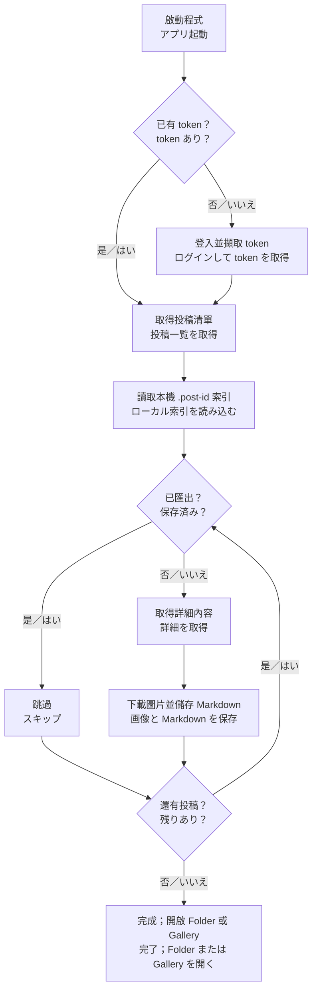

# Takaneko Fanclub Downloader

Takaneko Fanclub 內容下載器。下載 Takaneko Fanclub 的投稿、圖片與 Markdown，並在桌面應用程式中瀏覽。

Takaneko Fanclub の投稿・画像・Markdown を保存し、デスクトップアプリで閲覧するためのダウンローダーです。

> 僅供已取得 Takaneko Fanclub 合法存取權限的使用者使用。請遵守網站條款、著作權與內容使用規範。
>
> 正規のアクセス権を持つユーザーのみ利用し、サイト規約・著作権・コンテンツ利用規約を遵守してください。

## 下載／ダウンロード

一般使用者不需要安裝 Node.js。請到 [Releases](https://github.com/Senachi124/TakanekoFanClubDownloader/releases) 下載對應作業系統的安裝檔。

通常の利用では Node.js のインストールは不要です。[Releases](https://github.com/Senachi124/TakanekoFanClubDownloader/releases) から OS に合うファイルをダウンロードしてください。

- Windows：下載 `.exe`；`Setup` 版本會安裝到系統，另一個 `.exe` 可直接執行。
  - Windows：`.exe` をダウンロードします。`Setup` 版はインストール用、もう一方の `.exe` は直接実行できます。
- macOS：下載 `.dmg` 後拖曳到 Applications；`.zip` 可解壓縮後使用。
  - macOS：`.dmg` を開いて Applications にコピーします。`.zip` は解凍して使用できます。

## 快速使用／クイックスタート

1. 開啟程式，按 Login／ログイン。
   - アプリを起動し、Login／ログインを押します。
2. 在內建視窗登入 Takaneko Fanclub，按 Token Capture／トークン取得。
   - 内蔵ウィンドウで Takaneko Fanclub にログインし、Token Capture／トークン取得を押します。
3. 在下載卡片設定下載並發數，預設為 5，可設定 1–32。
   - ダウンロードカードで並列数を設定します。既定値は 5、設定範囲は 1–32 です。
4. 按 Start Download／ダウンロード開始。
   - Start Download／ダウンロード開始を押します。
5. 等待下載完成；需要時可使用 Pause／一時停止、Resume／再開或 Cancel／停止。
   - 完了まで待ちます。必要に応じて Pause／一時停止、Resume／再開、Cancel／停止を使えます。
6. 按 Open Folder／フォルダを開く查看檔案，或切換到 Gallery／ギャラリー瀏覽圖片與文章。
   - Open Folder／フォルダを開くで保存先を開くか、Gallery／ギャラリーで画像と投稿を閲覧します。

## 下載流程圖／ダウンロードフローチャート

1. 登入並取得 API token。
   - ログインして API token を取得します。
2. 取得所有通知與投稿清單。
   - 通知と投稿一覧を取得します。
3. 讀取本機 `.post-id` 索引，跳過已經匯出的投稿。
   - ローカルの `.post-id` 索引を読み、保存済み投稿をスキップします。
4. 只抓取新投稿的詳細內容。
   - 新規投稿の詳細だけを取得します。
5. 下載圖片並寫入 `index.md`。
   - 画像を保存し、`index.md` を作成します。
6. 在 Gallery 顯示已匯出的內容。
   - Gallery に保存済みコンテンツを表示します。



## AIMD 快速檢查／AIMD による高速確認

AIMD 主要用來快速判斷「這篇投稿是否已經下載過」，不是用來下載內容，也不會取代必要的 API 請求。

AIMD は「その投稿が保存済みか」を高速に判定するための仕組みです。コンテンツをダウンロードする処理ではなく、必要な API リクエストを置き換えるものでもありません。

- 程式先掃描匯出資料夾內的 `.post-id` 檔案，建立已存在投稿的索引。
  - まず出力フォルダ内の `.post-id` を読み、保存済み投稿の索引を作ります。
- 檢查從目前並發數開始；成功時逐步增加，遇到檔案 I/O 錯誤時降低並發數，最多 32 個。
  - 現在の並列数から開始し、成功時は少しずつ増加、ファイル I/O エラー時は減少させます（最大 32 件）。
- 已存在的投稿會直接跳過詳細查詢與檔案輸出；只有新投稿使用 GUI 設定的並發數（預設 5）。
  - 保存済み投稿は詳細取得と出力をスキップし、新規投稿だけが GUI 設定値（既定値 5）で処理されます。
- 舊版本沒有 `.post-id` 的資料會在第一次更新時重新處理一次，之後就能正常跳過。
  - 旧バージョンで `.post-id` がない投稿は、初回更新時に一度だけ再処理され、以降はスキップできます。

## 匯出內容／出力内容

匯出根目錄是 Electron 的 `userData/exported`，實際位置依作業系統而不同。可使用 Open Folder／フォルダを開く開啟。

出力先は Electron の `userData/exported` です。実際の場所は OS により異なります。Open Folder／フォルダを開くから開けます。

```text
<userData>/exported/
├─ <member-name>/
│  ├─ pictures/
│  │  ├─ <release-date>_01.jpg
│  │  └─ ...
│  └─ <release-date>_<title>/
│     ├─ index.md
│     ├─ .post-id
│     ├─ <release-date>_01.jpg
│     └─ ...
└─ ...
```

`index.md` 包含標題、發送者、日期、文章內容與本機圖片連結。`.post-id` 是程式自動產生的索引檔，請勿手動修改或刪除。

`index.md` にはタイトル、送信者、日付、本文、ローカル画像へのリンクが含まれます。`.post-id` は自動生成される索引ファイルのため、手動で変更・削除しないでください。

## 登入與資料安全／ログインとデータ安全

登入 token 會由 `electron-store` 保存於 Electron 的使用者資料目錄，不會寫入專案資料夾。請勿將 token 分享給他人。

ログイン token は `electron-store` により Electron のユーザーデータディレクトリへ保存され、プロジェクトフォルダには保存されません。token を他人に共有しないでください。
